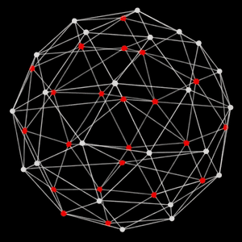

<!-- ===================== HEADER ===================== -->

  

<h1 align="center">Pranav Chaturvedi</h1>
<h3 align="center">Full Stack Developer</h3>

  
  
  

<!-- ===================== ABOUT ME ===================== -->
## 💫 About Me

I'm a full-stack developer who enjoys turning ideas into real, production-ready products. I build **scalable web applications** with the **MERN stack** and **Next.js**, with a focus on clean architecture, reusable components, and reliable REST APIs.

- 🚀 Currently building **AI-powered platforms** — from concept to deployment.
- 🧠 Love working on **full-stack systems**: real-time dashboards, auth flows, and AI-driven pipelines.
- ☁️ Exploring **AWS** and cloud-native architecture — always open to learning more.
- 🏆 AWS Certified Cloud Practitioner · Top-25 Contributor VSOC'24 · Finalist, Hackground India 2K25.
- 📫 Let's connect and build something impactful together!

<!-- ===================== TECH STACK ===================== -->
## 💻 Tech Stack

<table>
<tr>
<td valign="top" width="64%">

**Languages**

**Frontend**

**Backend**

**Databases**

**Cloud &amp; DevOps**

</td>
<td valign="middle" width="36%" align="center">

</td>
</tr>
</table>

<!-- ===================== GITHUB STATS ===================== -->
## 📊 GitHub Stats

  
   
  
   
  

---

  

<!-- Proudly created with GPRM ( https://gprm.itsvg.in ) -->
